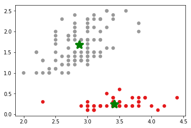
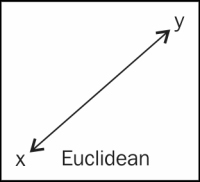
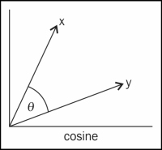
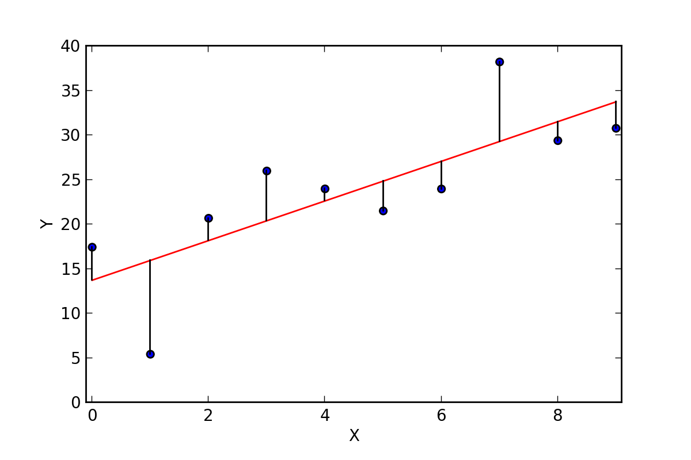
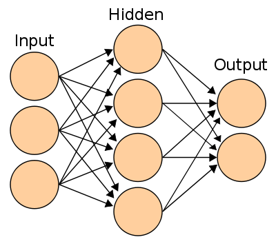
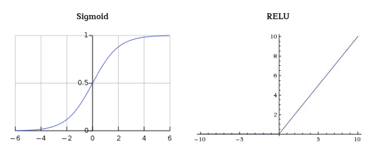
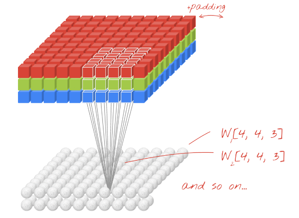
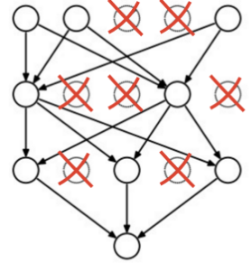
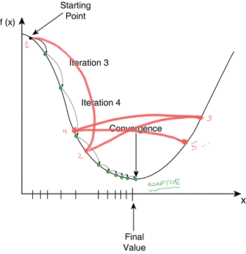

class: center, middle, titlescreen

# Machine Learning, a practical intro
## A talk by [@elzekool](https://github.com/elzekool)

???

Welcome to my talk "Practical IoT for webdevelopers"

---
# About me
* I work at Youwe as a Magento software architect
* I have a background in Electrical Engineering
* I have many hobbies, all related to technology, at home I have a lasercutter, cnc-mill and 3D printer that also grab my attention

.width-25[]

---
# What is this talk about?

Not completly true, but you could say Machine Learning is an evolution of Business Inteligence which in turn is made possible by the gathering of data (big data), so that is the flow we are going to follow:

* **(Big) Data** An introduction to "Big Data" and how to work with data

* **Unsupervised Learning** Clustering data into sets and do collaberative filtering

* **Supervised Learning** Classification, Regression, Neural networks, Deep learning

.width-65[]

---
# Big Data

The definition of Big Data is data that is to large to work with by using traditional data processing software. Where this boundy lies is vague. But a distinct pattern is that big data software is almost always horizontally scalable. Two very common systems I want to quickly introduce are:

* **Apache Hadoop** Hadoop is a combination of three major parts; a file system HDFS, a resource manager/planner YARN and MapReduce a programming model to work with the data.

* **Apache Spark** Spark provides a more high level programming API for parallel processing with a concept of fault resilient distributed datasets. It tries to keep data in memory and therefor is good in iterative processes.

.width-50[]

---
# Hadoop; HDFS and MapReduce

HDFS can be compared to a file system. Data written to HDFS is split up and distributed to the different nodes. MapReduce makes that the processing is done where the data is stored. 

**Map** performs filtering, sorting and data unification and is done completely independend, **Reduce** is collection and summerizing

.width-65[] <small>http://www.glennklockwood.com/data-intensive/hadoop/overview.html</small>

---
# Spark

Hadoop's MapReduce is fast for single iteration tasks, but iterative processes are slow because all the intermediate needs to be written/distributed. Also programming Hadoop is very low level. Apache Spark has a more easy to use programming interface, keeps a result cache in memory and has a task optimizer. Apache Spark also is able to use streaming data sources and multiple languages. Spark is often used toghether with Hadoop.

.width-65[]

---
# Data, very important
You're here for learing something about Machine Learning, so I keep it short, but data is everything!

* **Noise** It is important that you remove all the noise from data. If recording views remove your own test views. If recording temperature remove temperatures that are invalid, etc.

* **Scaling** Try to rescale your data so that every input has the same scale, als remove large biases. Histograms are usefull for seeing distributions.

* **Duplicates** Remove data that is the same or you know are highly related. For example if you record distance driven maybe you have to remove the time that it took if you are not seeking a correlation between them.

* **Reshape** For non-ordinal data you need to reshape the data. Some algoritms do not use ordinal relation but most of them to. A common practice is then to apply a one-hot/multiple-hot strategy.

---
# Unsupervised/Supervised learning

You can classify Machine Learning into two types; Unsupervised and Supervised learning. 

Unsupervised                     | Supervised
-------------------------------- | --------------------------------
Learning without prior knowledge | Use labeled data to train model
**Clustering**: A clustering problem is where you want to discover the inherent groupings in the data | **Classification**: Machine is trained to classify something into some class.
**Association**: An association rule learning problem is where you want to discover rules that describe large portions of your data | **Regression**: Machine is trained to predict some value like price, weight or height.

**Unsupervised**: I have 100 pebbles with different sizes, create 3 groups of them.
**Supervised**: I have 50 pebbles, I will tell you in wich group those are so you can do the rest.

---
# Clustering, basis
Clustering is the technique to group elements in a number of groups (clusters). There are a lot of clustering algorithms. 

Important factors in clustering algoritms:

* **Hard/Fuzzy clustering** In hard clustering each item belongs to one cluster only. In fuzzy clustering an item can belong to multiple clusters. 
* **Flat/Hierarchical clustering** In hierarchical clustering you have a hierarchy of clusters (you can think of it as a tree of clusters). In flat clustering you have one set of clusters.
* **Memorybased/Modelbased clustering** In memorybased clustering the whole dataset is used to determine in which cluster an item falls. In modelbased a model is created that fits the data and that is than used to cluster items.

---
# Clustering, K-means
K-means is a very common algorithm used for clustering. It aims to partition items into `n` clusters in which each item belongs to the cluster with the nearest mean. 

Pseudocode: *Pick `n` random centroids. Assign all items to the closest centroid. For each cluster recalculate the centroid by calculating the mean. Repeat until convergence or limit of iterations.*

.width-45[] Notebook: [K-means clustering example](http://localhost:8888/notebooks/K-means%20clustering%20example.ipynb)

---
# Clustering, distance
Distance is important in clustering. Based on the application different distance measure is usefull. 

* .width-20[] **Euclidean distance** Euclidean distance is the line distance between two points in euclidean space. The example shown in the previous slide was an example of this.

* .width-20[] **Cosine distance** Each point is seen as a vector. Cosine distance doesn't use the length of the vector but the angle between them as distance. Used a lot for text clustering in combination with Td-Idf. Notebook: [BBC text similarity and clustering](http://localhost:8888/notebooks/BBC%20text%20similarity%20and%20clustering.ipynb)

* .width-20[] **Jaccard distance** Used for determining the similarity(distance) between two sets. Example usage is to see how similar users are based on purchases.

---
# Collaborative filtering
Collaborative filtering is used to determine how a user would rate an item he didn't rate yet based on the ratings of similar users. This is different from content-based filtering where attributes of items the user has given a preference for is used to find other items. You could say collaberative filtering is filling in the gaps of a user <-> item matrix:

|        | Item 1 | Item 2 | Item 3 | Item 4 |
|  ----- | ------ | ------ | ------ | ------ | 
| User 1 |   1    | **?**  | **?**  |   3    |
| User 2 | **?**  |   2    |   6    | **?**  |
| User 3 |   5    | **?**  | **?**  |   3    |
| User 4 | **?**  |   3    |   1    | **?**  |
| User 5 |   4    |   5    | **?**  |   2    |

---
# User- and Item-based
There are two approaches for collaborative filtering:

* **User based** similar users are identified and item ratings or preferences are predicted based on the ratings or preferences of the similar users
* **Item based** measures the similarities between different items and picks the top k closest (in similarity) items to a given item in order to arrive at a rating prediction or preference for a given user for a given item.

.width-50[]

Notebook: [Movielens Collaborative filtering example](http://localhost:8888/notebooks/Movielens%20Collaborative%20filtering%20example.ipynb)

---
# Single Value Decomposition
Single Value Decomposition is a matrix factorization method. Basicly what you (or the system) does is find features in the user ratings and use the relations between them to make a prediction. A feature could be genre or actor but that information is not explicitly given, it is derived. A good reason why Single Value Decomposition could be usefull:

For example, if I’ve listened to 5 Metallica songs and you’ve listened to 5 different Metallica songs, the raw user action matrix wouldn’t have any overlap so we would not be considered similar users.

If we can derive the underlying tastes or preferences we could solve this problem, that is what Single Value Decomposition does. 

Notebook: [Movielens SVD collaborative filtering](http://localhost:8888/notebooks/Movielens%20SVD%20collaborative%20filtering.ipynb)

---
# Supervised Learning
Supervised learning is different from unsupervised learning in that we have two kinds of variables:

* **Target variables** These are the variables that should be the output
* **Predictor variables** These are the observations or the variables that are mapped to the target variable

Based on the type of **Target variables** we have two disctinct types of predictions:

* **Regression** When the target variable is ordinal/continous we call it regression.
* **Classification** When the target variables output discrete values we call it classification.

---
# Linear regression
With linear regression you try to find the coefficients that describe the relation between input predictor variables and the target variable. This is done by creating the line function (intercept and slope) that limits the sum of squared errors.

.width-65[]

Notebook: [Linear regression example with statsmodel](http://localhost:8888/notebooks/Linear%20regression%20example%20with%20statsmodel.ipynb)

---
# Decission Tree classifier
A decission tree classifier is a classifier that uses a tree of conditions with a true or false branch for each condition. Those conditions are inferred from training.

* **Advantages** of a decission tree classifier are that it can be used for ordinal and categorical data and combinations of them, their simple to understand and is unsensitive about value bias and scale differences.

* **Disadvantages** are that for linear data the tree tends to get overly complex and sensitive to noice and overfitting also can happen quickly.

There are different algorithms of building the tree, two common ones are **Gini impurity** and **Information gain**. Both metrics are different but the effective results are almost the same. The decision is picked where the smallest set of remaining labels remains in the largest set of remaining rows.

Notebook: [Decission Tree Classifier for IRIS dataset](http://localhost:8888/notebooks/Decission%20Tree%20Classifier%20for%20IRIS%20dataset.ipynb)

---
# Naive Bayes classifier
A well known classifier as it is a long time been used for classifying SPAM e-mails. The formula is:  ** P(A|B) = P(B|A) * P(A) / P(B). **

* **P(A)** and **P(B)** are the probabilities of A and B, independent of each other
* **P(A|B)**, a conditional probability, is the probability of A given that B is true
* **P(B|A)**, is the probability of B given that A is true

So for example in the case of a SPAM filter. **P(A)** is the probability of an e-mail being SPAM. **P(B)** is the probability that a word is in an e-mail. **P(B|A)** is the probability that the SPAM word is in a SPAM e-mail. All this factors can be determined by past data. With this data you can determine **P(A|B)** which gives the probability that when the SPAM word is given the e-mail is SPAM. Given that **P(B)** is the divider it makes sense, when a word is comon relative to the times it is spam the chance of being it SPAM gets smaller.

Notebook: [Using Naive Bayes to classify text](http://localhost:8888/notebooks/Using%20Naive%20Bayes%20to%20classify%20text.ipynb)

---
# Evaluation, metrics (1)
It is usefull to evaluate your model, in the end but also for optimizing.

Which metric is usefull depends on the type of target variables. Interpeting evaluation metrics in an absolute sense is hard, therefor most common usage is in relative 
comparison.

There are a lot of metrics. Each with the own pro's and cons's. But also the metric is dependend on the target variables.

* **RMSE** Root-mean-square deviation represents the sample standard deviation of the differences between predicted values and observed values. A larger error in samples has a disproportionately large effect on the output RMSE.

* **MAE** Mean-absolute-error is a far more simple to understand metric. It's the mean of all absolute errors between prediction and outcome. It doesn't penetalize larger errors over small errors.

The absolute values of both metrics depend on the scale of the target variables.

---
# Evaluation, metrics (2)

* **Coefficient of determination** Used in linear regression it is calculated as the correlation between the observed target values and the predicted values.

* **Precision and recall** commonly used in evaluating recommenders, it mesures the selected elements in the output set that are relevant (precision) against the number of items in the set from the set of relevant items (recall). Most of the time the precision increases, recall decreases. 

* **Cross entropy** represents the distance (more precise bits) between the probability distribution returned as the target variable against the true label. 

---

# Evaluation, cross validation
When training your model it is imporant that you don't overfit your model. **Overfitting** means that your model is good at predicting your training data but not at other data. 

Therefor it is common to use  **cross validation**, to split or the data into a training set and a test set. Two common ways are:

* **Simple split** A simple split just removes a given amount of samples randomly from the training set and puts them in a test set. The danger of this is that your test set is not a good representation of the distribution of the actual data.

* **K-fold** To remedy this with K-fold can be used. With K-fold the dataset is split into multiple parts. The model is trained multiple times and each time a different part of the dataset is left out as test set.

---
# Neural Network and Deep Learning
The concept of a neural network is based on the brains of humans and animals. A neuron in a neural network does a weighted sum of all of its inputs, adds a constant called the "bias" and then feeds the result through some non-linear activation function.

Each network is different. But every network has input neurons (or input layer) and output neurons (or output layer). Layers between input and output are called hidden layers.

.width-40[]

---
# The neuron
The neuron in a network has inputs that are variable. The weight of each input is trained togheter with the bias. The output of this is then feeded into the activation function of the neuron. 

Two common activation functions are **Sigmoid** and **RELU** where the latter is more commonly used in hidden layers.

.width-100[]    

---
# Training the network
When a neural network is created the weights and biases are randomly initialized and the network wont give any usefull predictions. Therefor it needs to be trained, two common ways to do this training are:

* **Gradient Descend** This is commonly used for situations where output can be mathematicly evaluated. To do this a **loss function** is needed. The network then tries to minimize the loss. Notebook: [MNIST Demo with a simple neural network](http://localhost:8888/notebooks/MNIST%20Demo%20with%20a%20simple%20neural%20network.ipynb)

* **Genetic Algorithm** This is commonly used for situations where the output cannot be mathematicly evaluated. For example when we train the network to perform a game. For each network the **fitness** is determined. The fittest networks are then kept and the rest discared. New networks are than created with random mutations based on the fitest networks. Nice example: [Machine Learning Algorithm with Flappy Bird](http://www.askforgametask.com/tutorial/machine-learning-algorithm-flappy-bird/)

---
# Convolutional layers
.width-50-r[]
Normal neural network layers are fully connected layers, saying that every neuron in the first layer is connected to every neuron in the second layer. This doesn't scale well for larger images and misses the importance of locality. Convolutional layers are only connected to a specific matrix above, as shown:

It is studied that our brain uses the same mechanism for our eyes. After or in between convolution layers there are often pooling layers that downsample the matrix.

---
# Recurrent Neural Network
In some cases, for example in speech and text recognizion, not only the current input is important but also previous input. This is where recurrent neural networks are used. In a recurrent network the output of a neuron is added as an extra input to the neuron. This way it knows from the past.

.width-65[]

Training required **unfolding**. If a RNN neuron was trained the regular way the optimizer would not know if a change was caused by an weight/bias optimization or from the previous state. With unfolding a RNN cell is multiplied multiple times with the same weights and biases. Data is than inputed in shifting historical order.

---
# Dropout, Learning Rate Decay
.width-30-r[] Overfitting is a danger in every form of machine learning. Also with neural networks, more so with networks with more layers. Instead of generalizing the trends and factors, it more or less memorizes the training set. One technique to prevent this is by using dropout. With **dropout** random neurons in the network are temporary disabled while training. 
  

.width-30-l[] When a neural network is trained changes are made to weight and biases. The rate at which this happens is important. A large rate would not find the right value as it bounces over and back of the target. A very small rate would be optimal but takes a long time. By starting with a large rate and decaying the rate we overcome this issues.

---
# Resources (1)

Clustering:
* https://beckernick.github.io/law-clustering/

Collaborative filtering:
* http://blog.ethanrosenthal.com/2015/11/02/intro-to-collaborative-filtering/
* https://cambridgespark.com/content/tutorials/implementing-your-own-recommender-systems-in-Python/index.html

Single Value Decomposition:
* https://beckernick.github.io/matrix-factorization-recommender/

---
# Resources (2)

Decission Tree classifier
* https://www.youtube.com/playlist?list=PLOU2XLYxmsIIuiBfYad6rFYQU_jL2ryal

Naive Bayes
* http://zacstewart.com/2015/04/28/document-classification-with-scikit-learn.html

Tensorflow:
* https://codelabs.developers.google.com/codelabs/cloud-tensorflow-mnist/
* http://www.askforgametask.com/tutorial/machine-learning-algorithm-flappy-bird/

