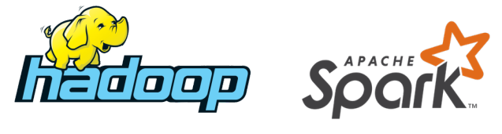
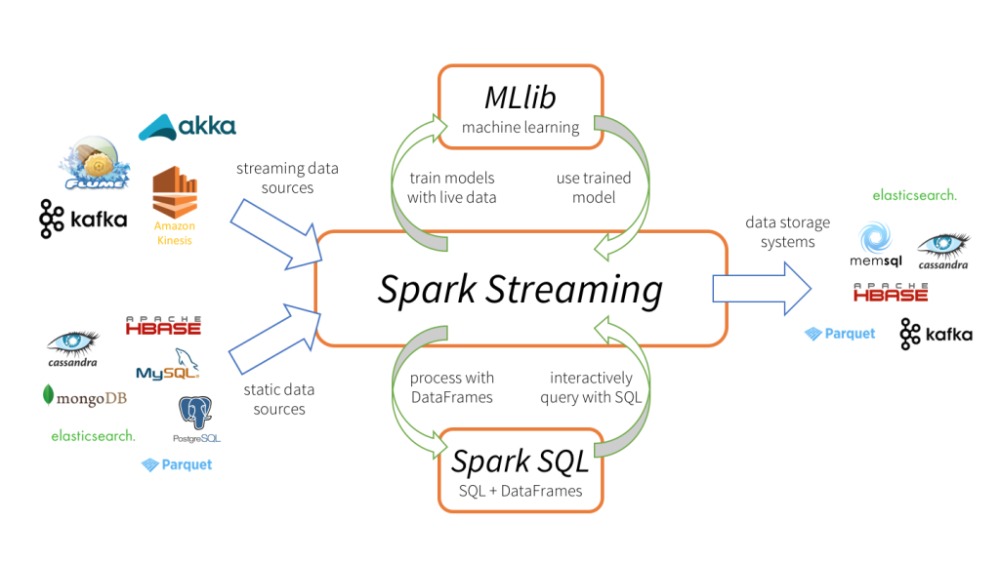
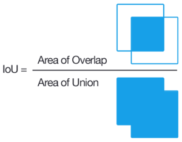
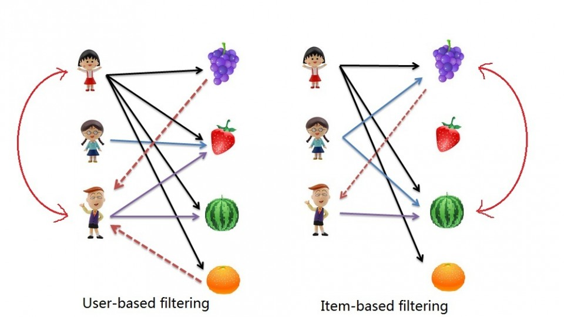

class: center, middle, titlescreen

# Machine Learning, a practical intro
## A talk by [@elzekool](https://github.com/elzekool)

???

Welcome to my talk "Practical IoT for webdevelopers"

---
# About me

* I work at Youwe as a Magento software architect
* I have a background in Electrical Engineering
* I have many hobbies, all related to technology, at home I have a lasercutter, cnc-mill and 3D printer that also grab my attention

---
# What is this talk about?

Not completly true, but you could say Machine Learning is an evolution of Business Inteligence which in turn is made possible by the gathering of data (big data), so that is the flow we are going to follow:

* **(Big) Data** An introduction to "Big Data" and how to work with data

* **Unsupervised Learning** Clustering data into sets and do collaberative filtering

* **Supervised Learning** Classification, Regression, Neural networks, Deep learning

.width-65[]

---
# Big Data

The definition of Big Data is data that is to large to work with by using traditional data processing software. Where this boundy lies is vague. But a distinct pattern is that big data software is almost always horizontally scalable. Two very common systems I want to quickly introduce are:

* **Apache Hadoop** Hadoop is a combination of three major parts; a file system HDFS, a resource manager/planner YARN and MapReduce a programming model to work with the data.

* **Apache Spark** Spark provides a more high level programming API for parallel processing with a concept of fault resilient distributed datasets. It tries to keep data in memory and therefor is good in iterative processes.

.width-50[]

---
# Hadoop; HDFS and MapReduce

HDFS can be compared to a file system. Data written to HDFS is split up and distributed to the different nodes. MapReduce makes that the processing is done where the data is stored. 

**Map** performs filtering, sorting and data unification and is done completely independend, **Reduce** is collection and summerizing

.width-65[] <small>http://www.glennklockwood.com/data-intensive/hadoop/overview.html</small>

---
# Spark

Hadoop's MapReduce is fast for single iteration tasks, but iterative processes are slow because all the intermediate needs to be written/distributed. Also programming Hadoop is very low level. Apache Spark has a more easy to use programming interface, keeps a result cache in memory and has a task optimizer. Apache Spark also is able to use streaming data sources and multiple languages. Spark is often used toghether with Hadoop.

.width-65[]

---
# Data, very important
You're here for learing something about Machine Learning, so I keep it short, but data is everything!

* **Noise** It is important that you remove all the noise from data. If recording views remove your own test views. If recording temperature remove temperatures that are invalid, etc.

* **Scaling** Try to rescale your data so that every input has the same scale, als remove large biases. Histograms are usefull for seeing distributions.

* **Duplicates** Remove data that is the same or you know are highly related. For example if you record distance driven maybe you have to remove the time that it took if you are not seeking a correlation between them.

* **Reshape** For non-ordinal data you need to reshape the data. Some algoritms do not use ordinal relation but most of them to. A common practice is then to apply a one-hot/multiple-hot strategy.

---
# Unsupervised/Supervised learning

You can classify Machine Learning into two types; Unsupervised and Supervised learning. 

Unsupervised                     | Supervised
-------------------------------- | --------------------------------
Learning without prior knowledge | Use labeled data to train model
**Clustering**: A clustering problem is where you want to discover the inherent groupings in the data | **Classification**: Machine is trained to classify something into some class.
**Association**: An association rule learning problem is where you want to discover rules that describe large portions of your data | **Regression**: Machine is trained to predict some value like price, weight or height.

**Unsupervised**: I have 100 pebbles with different sizes, create 3 groups of them.
**Supervised**: I have 50 pebbles, I will tell you in wich group those are so you can do the rest.

---
# Clustering, basis
Clustering is the technique to group elements in a number of groups (clusters). There are a lot of clustering algorithms. 

Important factors in clustering algoritms:

* **Hard/Fuzzy clustering** In hard clustering each item belongs to one cluster only. In fuzzy clustering an item can belong to multiple clusters. 
* **Flat/Hierarchical clustering** In hierarchical clustering you have a hierarchy of clusters (you can think of it as a tree of clusters). In flat clustering you have one set of clusters.
* **Memorybased/Modelbased clustering** In memorybased clustering the whole dataset is used to determine in which cluster an item falls. In modelbased a model is created that fits the data and that is than used to cluster items.

---
# Clustering, K-means
K-means is a very common algorithm used for clustering. It aims to partition items into `n` clusters in which each item belongs to the cluster with the nearest mean. 

Pseudocode: *Pick `n` random centroids. Assign all items to the closest centroid. For each cluster recalculate the centroid by calculating the mean. Repeat until convergence or limit of iterations.*

.width-45[] Notebook: [K-means clustering example](http://localhost:8888/notebooks/K-means%20clustering%20example.ipynb)

---
# Clustering, distance
Distance is important in clustering. Based on the application different distance measure is usefull. 

* .width-20[] **Euclidean distance** Euclidean distance is the line distance between two points in euclidean space. The example shown in the previous slide was an example of this.

* .width-20[] **Cosine distance** Each point is seen as a vector. Cosine distance doesn't use the length of the vector but the angle between them as distance. Used a lot for text clustering in combination with Td-Idf. Notebook: [BBC text similarity and clustering](http://localhost:8888/notebooks/BBC%20text%20similarity%20and%20clustering.ipynb)

* .width-20[] **Jaccard distance** Used for determining the similarity(distance) between two sets. Example usage is to see how similar users are based on purchases.

---
# Collaborative filtering
Collaborative filtering is used to determine how a user would rate an item he didn't rate yet based on the ratings of similar users. This is different from content-based filtering where attributes of items the user has given a preference for is used to find other items. You could say collaberative filtering is filling in the gaps of a user <-> item matrix:

|        | Item 1 | Item 2 | Item 3 | Item 4 |
|  ----- | ------ | ------ | ------ | ------ | 
| User 1 |   1    | **?**  | **?**  |   3    |
| User 2 | **?**  |   2    |   6    | **?**  |
| User 3 |   5    | **?**  | **?**  |   3    |
| User 4 | **?**  |   3    |   1    | **?**  |
| User 5 |   4    |   5    | **?**  |   2    |

---
# User- and Item-based
There are two approaches for collaborative filtering:

* **User based** similar users are identified and item ratings or preferences are predicted based on the ratings or preferences of the similar users
* **Item based** measures the similarities between different items and picks the top k closest (in similarity) items to a given item in order to arrive at a rating prediction or preference for a given user for a given item.

.width-50[]

Notebook: [Movielens Collaborative filtering example](http://localhost:8888/notebooks/Movielens%20Collaborative%20filtering%20example.ipynb)

---
# Single Value Decomposition
Single Value Decomposition is a matrix factorization method. Basicly what you (or the system) does is find features in the user ratings and use the relations between them to make a prediction. A feature could be genre or actor but that information is not explicitly given, it is derived. A good reason why Single Value Decomposition could be usefull:

For example, if I’ve listened to 5 Metallica songs and you’ve listened to 5 different Metallica songs, the raw user action matrix wouldn’t have any overlap so we would not be considered similar users.

If we can derive the underlying tastes or preferences we could solve this problem, that is what Single Value Decomposition does. 
---

# Resources
* https://beckernick.github.io/law-clustering/
* https://cambridgespark.com/content/tutorials/implementing-your-own-recommender-systems-in-Python/index.html
* http://blog.ethanrosenthal.com/2015/11/02/intro-to-collaborative-filtering/
* https://beckernick.github.io/matrix-factorization-recommender/
* http://www.askforgametask.com/tutorial/machine-learning-algorithm-flappy-bird/
